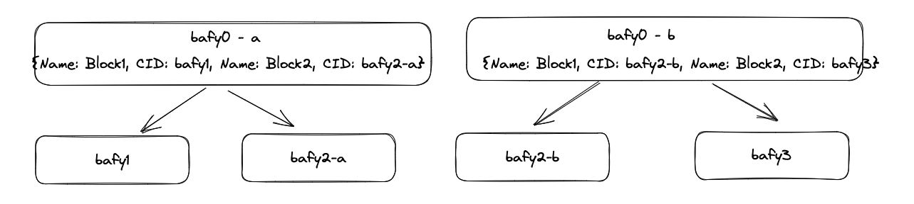

# Why CAR first then split

> The following advice is a bit more prescriptive than originally intended in interest of simplicity. 

> The actual advice is to split data along the logical boundaries of the data to encode the payload CIDs one cares about for retrievals, but at the same time also to maintain the hierarchical dag structure to enable logical retrieval patterns.

> In the following document it is assumed that “files” are the logical boundaries of the data.

*Problem statement*: Files larger than sector size need to be handled specially in the
data preparation phase. The data preparer then needs to decide whether to split these
large files into smaller files, and then generate CARs, or to first generate a single CAR and
then split it into smaller CARs.

In the following illustration we will walk through the two scenarios, and the impact they
have on retrievals.

Spoiler alert- -- :warning: Splitting files _first_ is bad for retrievals!

## Setup

In the following illustration we have made the following assumptions:

- block sizes are 2 MB
- the data we are handling (`bafy0` ) is 6 MB
- sector sizes are capped at 5 MB, so we want the CAR files to be at most 5 MB in size.
- Retrievals for this data will be done over bitswap, i.e., we will be fetching one block at a time.

The dag for the full 6 MB data looks like:

each of the leaf nodes (bafy1, bafy2 and bafy3 are 2 MB each).

## :white_check_mark: DO THIS: CAR first, then split

If we split the car file in a way that maintains the dags, but just puts blocks in
different car files, for instance by using a library like [go-carbites](https://github.com/alanshaw/go-carbites), then we get the following picture:

where `bafy0`, `bafy1` and `bafy2` are in one car file, and `bafy3` is in another car files, and therefore in separate deals.

However, because the client knows the cid `bafy0` they can easily retrieve their data over bitswap (one block at a time), even if they are spread across two different deals.

## :x: DO NOT DO THIS: Split first, then CAR

Whereas if we split the file first and then generate car files, we get the following picture:

Note that now the user has 2 payload cids associated with their single dataset — `bafy0-a` and `bafy0-b`. In fact `bafy0` won't even get computed at all because the dag is split, and cids are calculated “bottom up”.

To retrieve their full data, the user now needs to (1) maintain the mapping from original file to the splits somewhere (2) reassemble the file after retrieving it.

## Lessons and additional thoughts

- Maintaining the dag structure is important for retrievals, because it encodes how the separate blocks are logically related. In the above illustration, whether or not the integrity of `bafy0` is preserved has a signifcant impact on the retrieval UX.
- Retrieval over bitswap, i.e., one block at a time means it doesn’t matter if the blocks are spread across multiple deals. As long as the dag structure is there, data is still retrievable.
- This wasn’t discussed in detail in the above example, however, splitting files before CAR also prevents range requests (over http for example). This is because if a request is made that spans over the two separate DAGs, there is no way to respond to it.
