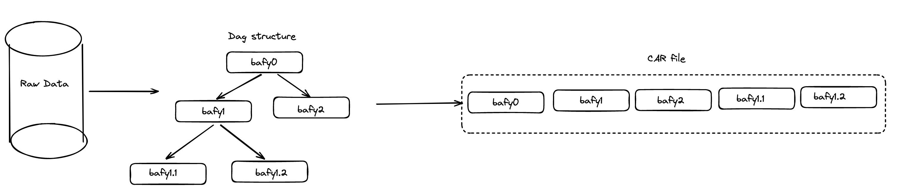
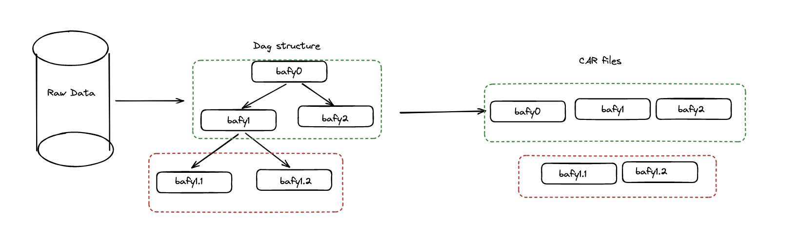
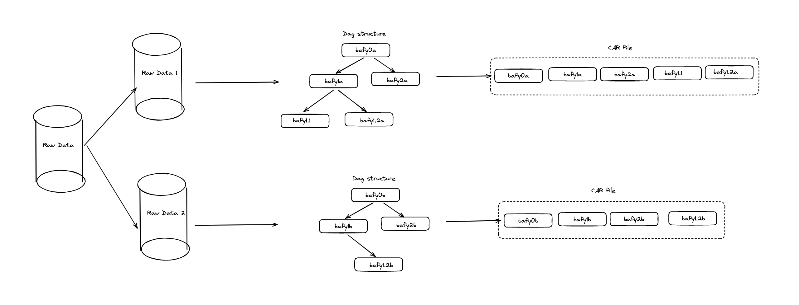

# Data preparation and retrieval patterns

The methodology used in preparing data is closely tied to the retrieval patterns it
enables[^dataPrepAndRetrieval]. 

The key question to address is at what point in the data onboarding pipeline does the data
get represented as a dag[^dag] (if at all). Let us consider a few example scenarios to
understand this better.

## Simple case

In a simple onboarding pipeline where the size of the raw data is less than a sector but
still large enough to be economically viable for a storage provider to accept the deal we
can easily create the dag and store it whole in a car file, and subsequently in a deal:

In this case the user can choose to retrieve data in multiple ways:
1. block-by-block using a block based protocol such as [bitswap](https://github.com/ipfs/boxo/tree/main/bitswap),
2. graph based protocol such as [graphsync](https://ipld.io/specs/transport/graphsync/),
3. or just fetch the whole car file over http.

The way the data is structured the user can fetch partial or whole data without
requiring any additional processing.

## DAG (or CAR) first then split

If the size of the data is too large and needs splitting, one way to do this is to keep
the dag intact and split the car file[^carFirstThenSplit]. In this case we end up with an
onboarding pipeline that looks like:

In this case block based retrievals will work same as the simple case. Therefore a
retrieval pattern such as exploring a filesystem will work seamlessly with no additional
work required by the user.

However, if the user wants to fetch all of the data by directly downloading the car file, the user
will need to make multiple http requests and stitch the car files together using a
[car-joiner tool](../tools/car-splitters-joiners.md).

## Split first then DAG (or CAR)

Another (not recommended by this author) way to handle large data is to split it first,
leaving us with an onboarding pipeline that looks like: 

In this case block based retrievals only work on the partial chunks of the data (raw
data-1, raw data-2 in the above example) because the dag structure isn't aware that the
separate chunks are in fact connected to each other. 

Therefore, if the retrieval patterns are limited to the separate chunks then this method
of preparation works fine. However, if the user wants to retrieve data that crosses the
boundaries between the separate chunks then they need to stitch the data together
themselves.

[^dataPrepAndRetrieval]: This is true in general but we will be focusing on the filecoin
case. For instance, consider personal bank transactions data. This could be structured in
time-based folders (a folder per day), or category-based folders (bills, groceries etc.).
Those two structures will enable different access patterns. 
[^dag]: Data added to [IPFS](https://ipfs.tech/) is represented in a DAG structure in [UnixFS
format](https://docs.ipfs.tech/concepts/file-systems/#unix-file-system-unixfs), which then
allows for block or graph based data transfer protocols such as [bitswap](https://github.com/ipfs/boxo/tree/main/bitswap) or
[graphsync](https://ipld.io/specs/transport/graphsync/)[^dataTransferProtocols]. One of
the key benefits of this structure is to have incremental verifiability of the data being
retrieved -- each and every block that is fetched can be verified independently.
[^carFirstThenSplit]: See [car first then split](./car-first-then-split.md) for further
detail.
[^dataTransferProtocols]: A [not-necessarily-comprehensive
list](https://pl-strflt.notion.site/Properties-of-Existing-or-proposed-Data-Transfer-Protocols-47eba8cf1f0945158b864366443194b0)
of existing and proposed data transfer protocols.

<!---
On the other hand, if the raw data is stored as-is (without converting to a dag) on a
server[^notFilecoin], then it is only retrievable in whole (or partially via
range requests) with no incremental verifiability built in.
[^notFilecoin]: Something like dropbox. Technically, this is also possible on filecoin,
but that is an advanced topic that won't be discussed here.
-->
