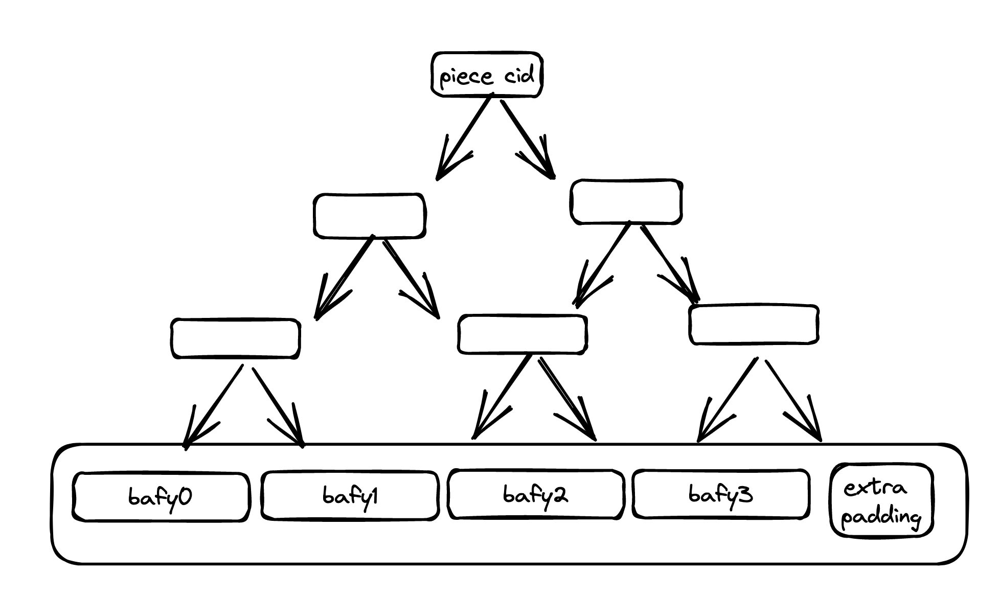

# Payload vs Piece CID

The difference between a payload CID and a piece CID causes a lot of confusion. 

When data is represented as as a [merkle
dag](https://docs.ipfs.tech/concepts/merkle-dag/), the content identifier (CID) associated
with any of the blocks in the dag is a payload CID.

A car file is just the serialised version of this dag. Now if you take a car file, treat
it as an opaque blob of bytes (even though the picture shows block boundaries, they don't
really exist), and calculate a balanced binary merkle tree on top of it -- the cid
associated with the root is the piece cid[^spec]. 

## Additional thoughts

Notice that during the calculation of piece cid, we treated the underlying car file as an
opaque blob of bytes. That is the structure encoded in the car file, i.e. it being a
serialised set of blocks originally from an ipld dag is not retained in this calculation.

This means one could in fact calculate piece cid for arbitrary data without ever
taking the intermediate step of constructing a merkle dag out of it. This is best seen in
the [go-fil-commp-hashhash](https://github.com/filecoin-project/go-fil-commp-hashhash)
package which implemnents piece cid calculation as a hash function that can operate on
arbitrary data.

Having said that, taking that intermediate step of representing data as an ipld dag helps
serve retrievals better as seen in [data preparation and retrieval
patterns](./best-practices/data-preparation-and-retrieval.md).

[^spec]: See [filecoin
spec](https://spec.filecoin.io/#section-systems.filecoin_files.piece) for more detail.
