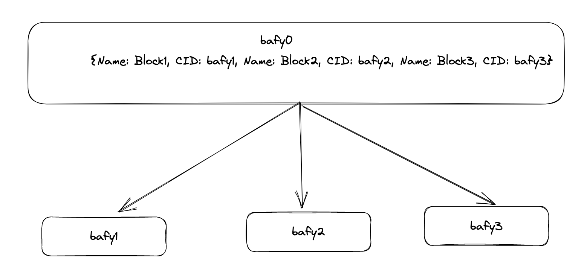

# Payload vs Piece CID

The difference between a payload CID and a piece CID causes a lot of confusion. 

When data is represented as as a [merkle
dag](https://docs.ipfs.tech/concepts/merkle-dag/), the content identifier (CID) associated
with any of the blocks in the dag is a payload CID.

A car file is just the serialised version of this dag. Now if you take a car file, treat
it as an opaque blob of bytes (even though the picture shows block boundaries, they don't
really exist), and calculate a balanced binary merkle tree on top of it -- the cid
associated with the root is the piece cid[^spec]. 

[^spec]: See [filecoin
spec](https://spec.filecoin.io/#section-systems.filecoin_files.piece) for more detail.
